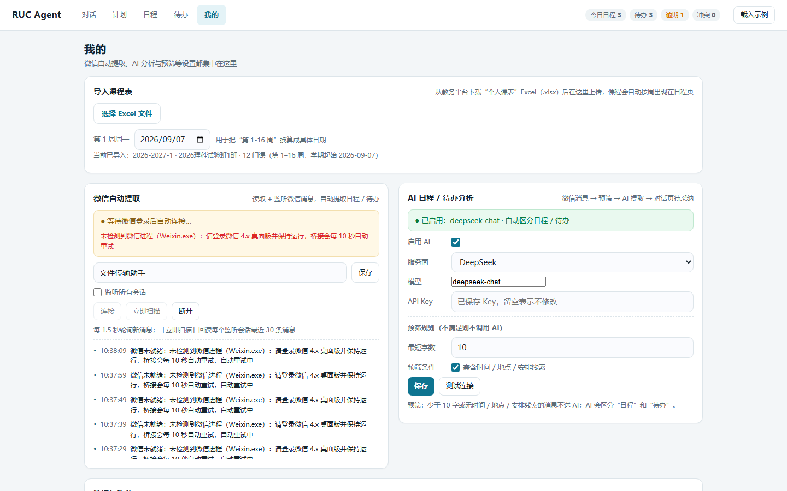

# RUC Agent｜校园日程智能助手

> 把对话和微信里的安排整理成日程与待办，再结合个人精力、任务压力和长期偏好给出可执行的排期建议。

RUC Agent 是一个本地运行的校园生活助手。你可以像聊天一样输入安排，也可以让它从微信消息和公众号推送中发现事项；识别结果经过确认后进入日程或待办，后续再由规划引擎检查冲突、评估风险并安排合适时段。

核心后端仅使用 Python 标准库，前端使用原生 HTML、CSS 和 JavaScript。即使不配置大模型，日程提取、待办管理、冲突检查和规则排期也可以使用；配置 AI 后可获得更复杂的语义理解、任务拆解、画像分析和自然语言建议。



## 核心体验

- **对话式录入**：直接输入“周四晚上 7 点在二教 401 开社团例会”，自动提取时间、地点和类别。
- **先确认，再入库**：对话和 AI 识别结果以“待采纳”卡片展示，可选择加入日程、加入待办或忽略。
- **日程与待办分流**：固定时间事项进入日程；只有截止时间或暂时无法排期的任务进入待办池。
- **跨日自动顺延**：今天之前仍未完成的普通日程会自动转入待办池等待重新规划；导入课表生成的课程不会顺延。
- **选择性规划**：结合截止时间、空闲时段、24 小时精力曲线和当前负载，只推荐现在值得规划的任务。
- **风险与冲突提示**：识别时间重叠、排期晚于截止时间、能量超载和低完成概率，并给出拆分或降标建议。
- **反馈闭环**：任务完成后可标记“轻松 / 正常 / 吃力”，系统用反馈校准后续时段的精力估计。
- **微信自动提取**：可监听文件传输助手、指定会话或全部会话，并支持从公众号推送中识别行动事项。
- **课程表导入**：支持导入教务平台导出的个人课表 `.xlsx`，课程会按教学周显示在日程中。
- **智能挡箭牌**：根据当前负载生成“婉拒 / 待定 / 接单”话术，帮助处理团建、聚餐等外部安排。
- **本地优先**：日程、画像、长期记忆和 API Key 默认只保存在本机 `data/` 目录。

## 页面概览

| 页面 | 用途 |
| --- | --- |
| 对话 | 输入自然语言安排，查看 AI 回复与待采纳结果 |
| 计划 | 查看精力曲线、排期建议、完成概率和挡箭牌 |
| 日程 | 按天查看时间轴，添加或拖动事项，检查冲突 |
| 待办 | 管理未排期任务、截止时间、优先级和完成反馈 |
| 我的 | 导入课程表，配置 AI、微信监听、画像和本地数据 |

## 快速开始

### 环境要求

- Python 3.9 或更高版本
- Windows、macOS 或 Linux 均可运行核心功能
- 微信自动提取仅支持 Windows，并要求微信桌面版 4.1.12+ 已登录

### 启动项目

核心功能无需安装第三方依赖：

```bash
python server.py
```

然后访问 <http://127.0.0.1:8000>。按 `Ctrl+C` 停止服务。

指定端口有两种方式：

```bash
python server.py 9000
```

```powershell
$env:PORT = "9000"
python server.py
```

首次体验可以在页面中依次尝试：

1. 在“对话”页输入一条自然语言安排并确认识别结果。
2. 在“待办”页添加一个带截止时间的任务。
3. 打开“计划”页查看排期建议和完成概率。
4. 采纳建议后，到“日程”页查看或拖动时间块。
5. 完成任务并反馈体感，让精力曲线逐步校准。

## 输入示例

| 输入 | 预期结果 |
| --- | --- |
| 周四晚上 7 点参加社团例会，在二教 401 | 识别日期、19:00、地点和活动类别 |
| 数学作业下周一上午 9 点前提交 | 识别为带硬截止时间的待办 |
| 明天上午 9 点去图书馆写论文，重要 | 创建高优先级事项 |
| 周六下午 3 点到体育馆参加篮球比赛 | 识别活动时间和地点 |
| 晚上八点半参加社团例会 | 支持中文数字时间，识别为 20:30 |
| 九月三日参加考试 | 支持中文数字日期 |
| 帮我买牛奶 | 无明确时间，保留在待办池等待规划 |

## 可选：启用 AI

未配置 AI 时，项目使用本地规则完成基础提取、排期、概率评估和话术生成。启用 AI 后，可增强复杂通知解析、对话理解、画像更新、任务拆解和建议生成。

在“我的 → AI 日程 / 待办分析”中：

1. 选择 OpenAI、DeepSeek、Kimi 或自定义 OpenAI 兼容服务。
2. 填写模型名和 API Key。
3. 点击“测试连接”。
4. 测试成功后启用并保存。

微信消息在发送给 AI 前会先经过本地预筛：过短且没有时间、地点或安排线索的闲聊不会上传。AI 调用失败时会回退到规则识别，并保留可供确认的结果。

AI 配置保存在 `data/ai_config.json`，其中包含 API Key。请勿提交、分享或截图公开该文件。调用 AI 时，相关消息内容会发送给你选择的服务商，其数据处理规则以对应服务商条款为准。

## 可选：微信自动提取

### 前置条件

1. 使用 Windows，并安装、登录微信桌面版 4.1.12+。
2. 安装仓库内置的微信适配库：

   ```bash
   python -m pip install -e wechatauto-replica-main
   ```

3. 启动 RUC Agent，进入“我的 → 微信自动提取”。

### 使用方式

- 默认监听“文件传输助手”，可把包含日程的消息转发到这里。
- 可填写其他昵称或备注名；多个会话用逗号分隔。
- 可选择监听全部会话，也可点击“立即扫描”回读最近消息。
- 新增监听会话时会回读最近 `backfill` 条消息，默认 30 条，并按消息序号去重。
- 实时监听默认每 1.5 秒轮询一次；运行期间也会继续发现新公众号会话。

未启用 AI 时，规则能够明确识别的普通微信日程会按原有规则自动入库；启用 AI 后，候选项会先进入“对话”页等待采纳。公众号内容无论是否启用 AI，都只把含报名、提交、缴费、预约、截止或活动通知等行动信号的内容放入待采纳队列，普通资讯和回顾文章不会写入待办。

微信配置位于 `data/wechat_config.json`，活动与处理状态位于 `data/wechat_activity.json` 和 `data/wechat_state.json`。

## Windows 安装包

安装版会打包 Python 运行环境，目标电脑无需单独安装 Python。个人数据保存在 `%LOCALAPPDATA%\RUC Agent\data`，与程序文件分离，正常升级或卸载不会覆盖这些数据。

在项目根目录构建安装包：

```powershell
python -m pip install -r packaging\requirements-build.txt
winget install --id JRSoftware.InnoSetup -e
powershell -ExecutionPolicy Bypass -File packaging\build.ps1
```

产物位于 `dist\installer\RUC-Agent-Setup-1.0.1.exe`，对应校验文件为 `dist\installer\SHA256SUMS-1.0.1.txt`。构建脚本会先运行自动化测试，再对冻结后的程序执行静态页面与核心 API 冒烟验证。

当前安装包未配置 Authenticode 代码签名，首次运行时 Windows 可能显示 SmartScreen 提示。请先核对 Release 附带的 SHA-256 校验文件，再决定是否运行；正式公开分发前建议配置代码签名。

## 数据与隐私

源码运行时，数据默认写入仓库的 `data/`；也可以通过 `RUC_AGENT_DATA_DIR` 指向其他目录。主要文件包括：

| 文件 | 内容 |
| --- | --- |
| `todos.json` / `courses.json` | 日程、待办和课程表 |
| `chat_thread.json` | 本地对话记录 |
| `ai_pending.json` / `ai_config.json` | 待采纳队列和 AI 配置 |
| `user_profile.json` / `user_state_history.json` | 动态画像与历史快照 |
| `user_memory.json` / `user_evidence.json` | 长期记忆与行为证据 |
| `planner_profile.json` / `planner_events.json` | 精力曲线与规划反馈 |
| `wechat_config.json` / `wechat_activity.json` / `wechat_state.json` | 微信配置、活动和处理状态 |

`data/` 已被 `.gitignore` 忽略。这个目录可能包含 API Key、微信状态和个人日程，请勿提交到 Git、粘贴到 Issue，或作为调试附件公开。

如需彻底重置源码版数据，请先停止服务并备份整个 `data/` 目录，再删除其中内容；这会同时清除日程、课程、配置、画像、记忆和处理状态，无法在应用内恢复。页面中的局部清理按钮适合只重置某一类数据。

## 项目结构

```text
server.py                    HTTP 服务入口
desktop.py                   Windows 安装版桌面启动器
app/
├─ ai/                       AI 网关、上下文、画像、记忆与状态评估
├─ core/                     文本提取、类别、冲突检测与 JSON 存储
├─ planner/                  精力曲线、排期、风险、拆解与挡箭牌
├─ web/handlers.py           页面与 API 路由
├─ wechat/bridge.py          微信读取、监听、回填与公众号识别
└─ paths.py                  静态资源和用户数据路径
app/version.py               应用版本号
static/                      原生前端页面、样式和交互脚本
tests/                       单元测试与真实 HTTP API 集成测试
packaging/                   PyInstaller 与 Inno Setup 构建脚本
docs/                        设计与技术文档
wechatauto-replica-main/     微信能力依赖的随仓库副本
```

核心数据流：

```text
对话 / 微信 / 课程表
        ↓
规则预筛 → AI 可选增强 → 规则兜底
        ↓
待采纳确认 / 明确规则入库
        ↓
日程与待办 → 画像、记忆、精力与风险评估
        ↓
规划建议 → 用户采纳与完成反馈 → 下一轮校准
```

## 开发与验证

运行全部自动化测试：

```bash
python -m unittest discover -s tests
```

当前项目共 76 项单元与端到端测试。还可以执行以下检查：

```bash
python -m compileall app tests server.py desktop.py
node --check static/app.js
python -m app.planner.demo
```

涉及浏览器交互、微信登录或真实 AI 服务的功能需要手动验证，详细步骤见 [ACCEPTANCE.md](ACCEPTANCE.md)。分支、提交和协作约定见 [CONTRIBUTING.md](CONTRIBUTING.md)。

## 已知边界

- 微信读取依赖 Windows、兼容版本的微信桌面端及本机登录状态。
- API Key 由用户自行提供；不同服务商的模型能力、费用和可用性可能不同。
- 拖拽排期基于原生 HTML5，桌面浏览器体验最佳，移动端可使用手动规划入口。
- 当前是本地单用户应用，尚未提供云同步、跨设备账户或系统级到期通知。

## Roadmap

- 桌面通知、邮件或微信到期提醒
- 导出 `.ics` 并与系统日历同步
- 更多学校课程表格式与一键导入
- 多端同步与可选的加密备份

### 构建 Windows 安装包

```powershell
python -m pip install -r packaging\requirements-build.txt
winget install --id JRSoftware.InnoSetup -e
powershell -ExecutionPolicy Bypass -File packaging\build.ps1
```

构建会使用隔离数据目录运行测试，不会修改本机 `data/`；随后生成目录版 EXE、
安装包和 SHA-256 校验文件。详细说明见 [packaging/README.md](packaging/README.md)。

## License

本项目采用 [Apache License 2.0](LICENSE)。`wechatauto-replica-main/` 是第三方项目 `wechatauto-replica` 的随仓库副本，同样保留其 Apache-2.0 许可证；修改该目录前请先阅读其中的 `LICENSE`。
